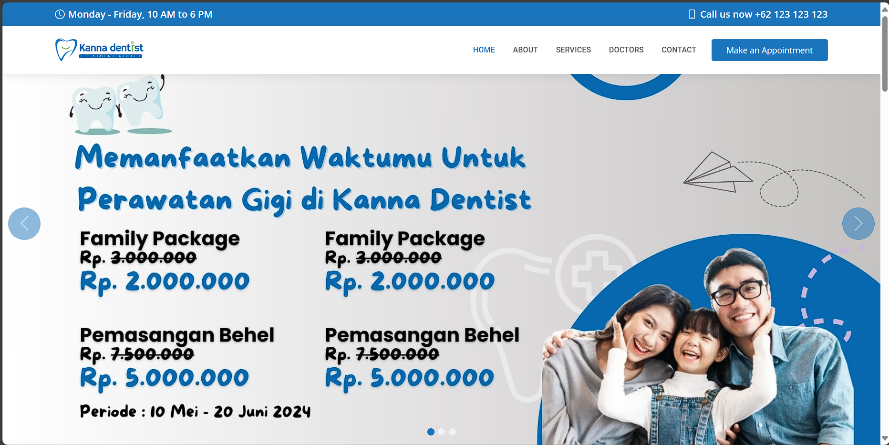
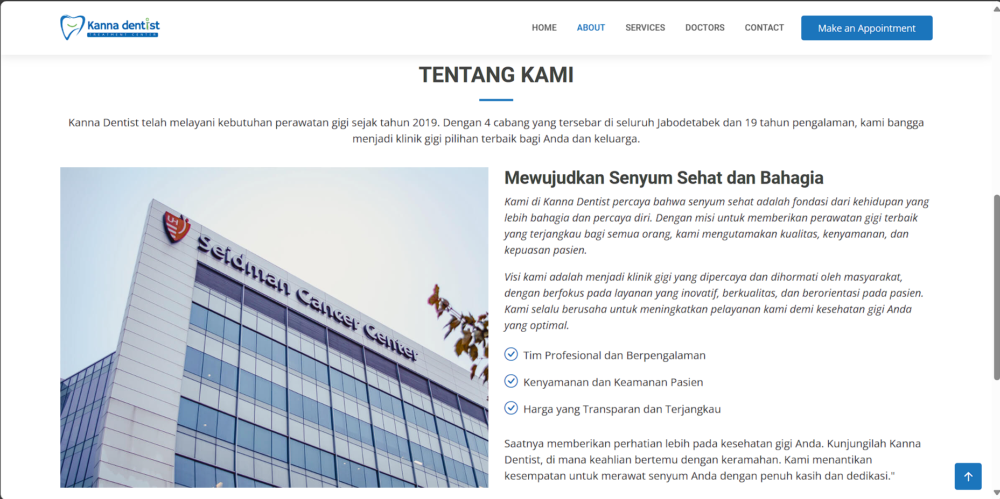
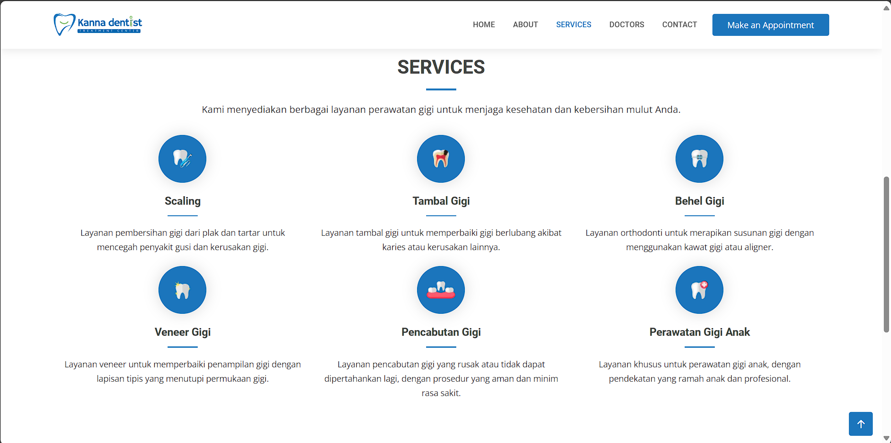
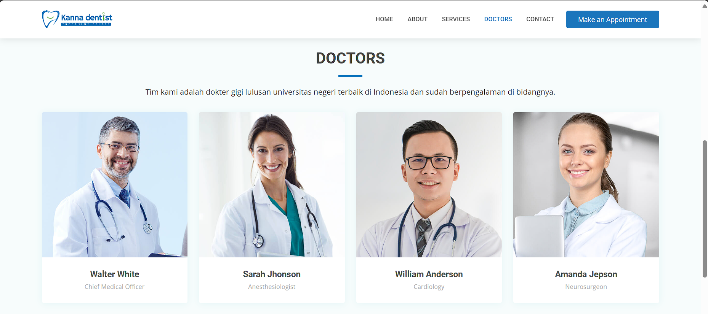
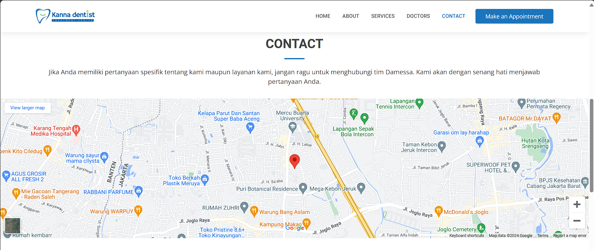
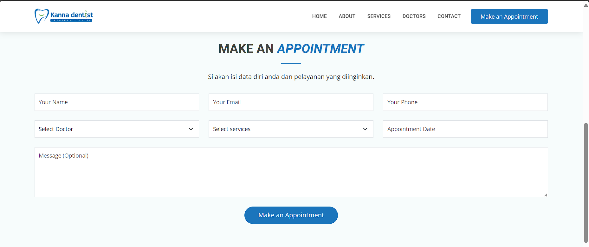
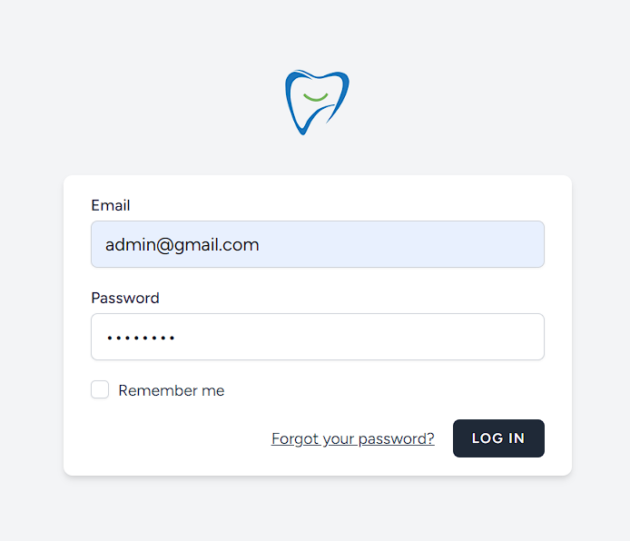
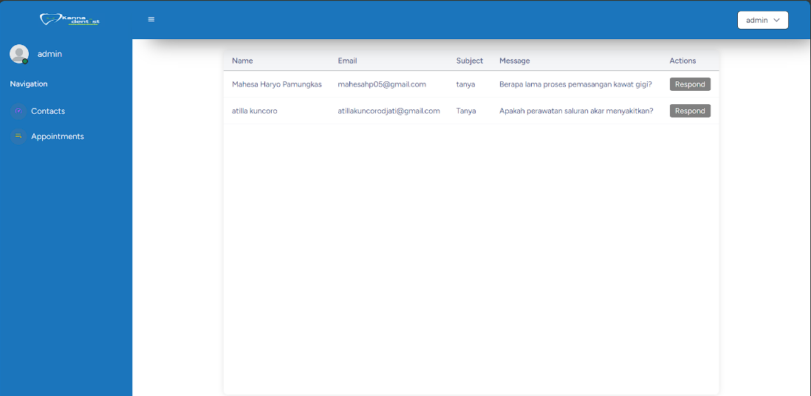
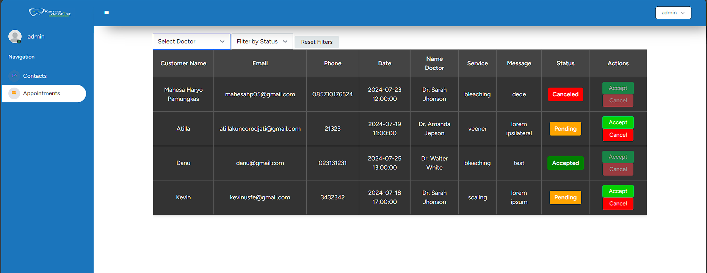
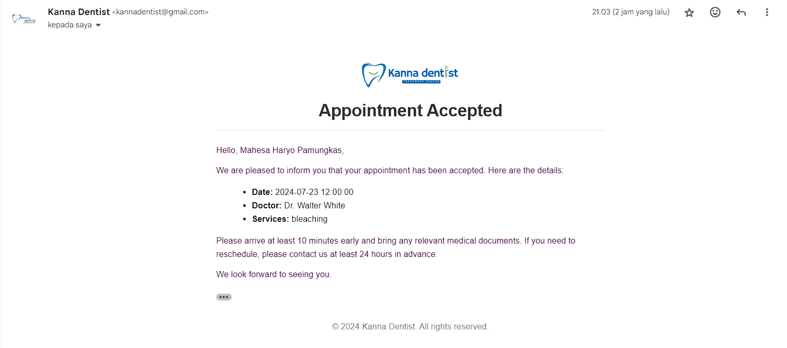

# 🦷 Kanna Dentist — Web-Based Appointment System

Kanna Dentist is a web-based dental clinic appointment system. Patients can browse clinic information, book appointments online, and send inquiries, while clinic administrators can manage incoming appointments, respond to patient messages, and track appointment status — all from a dedicated admin dashboard.



## ✨ Key Features

### For Patients (User)
- Browse clinic profile, vision & mission, services, and available doctors
- View doctor profiles along with their social media links
- Locate the clinic via an embedded Google Maps
- Submit inquiries through a contact form
- Book an appointment online (name, email, phone number, preferred date & time, doctor, and service)
- Receive email notifications when an appointment is **accepted** or **canceled**

### For Admin
- Secure login for clinic staff
- Dashboard to manage two main data sources: **Contacts** and **Appointments**
- Reply to patient inquiries directly from the dashboard (auto-sent to the patient's email)
- Review, filter (by doctor name and status), accept, or cancel appointment requests
- Track appointment status: `Pending`, `Accepted`, or `Canceled`
- Automatic email notification is sent to the patient whenever an appointment status changes

## 📸 Screenshots

| Homepage | About | Services |
|---|---|---|
|  |  |  |

| Our Doctors | Contact & Location | Book Appointment |
|---|---|---|
|  |  |  |

| Admin Login | Admin Dashboard | Appointment Management |
|---|---|---|
|  |  |  |

**Email Notification Example**



## 🛠️ Tech Stack

- **Backend:** Laravel (PHP)
- **Frontend:** Blade Template, HTML, CSS, JavaScript
- **Database:** MySQL
- **Email Service:** Laravel Mail

## 🚀 Getting Started

### Prerequisites
- PHP >= 8.0
- Composer
- MySQL
- Node.js & NPM (for compiling frontend assets)

### Installation

```bash
# 1. Clone the repository
git clone https://github.com/DanuSetiawan05/Appointment-Dentist.git
cd Appointment-Dentist

# 2. Install PHP dependencies
composer install

# 3. Install frontend dependencies
npm install
npm run dev

# 4. Copy the environment file and generate the app key
cp .env.example .env
php artisan key:generate

# 5. Configure your database and mail credentials in the .env file
# DB_DATABASE=kanna_dentist
# DB_USERNAME=root
# DB_PASSWORD=
# MAIL_MAILER=smtp
# MAIL_HOST=...
# MAIL_USERNAME=...
# MAIL_PASSWORD=...

# 6. Run database migrations
php artisan migrate

# 7. Serve the application
php artisan serve
```

The app will be available at `http://127.0.0.1:8000`.

To access the admin dashboard, register an admin account at `http://127.0.0.1:8000/register`, then log in at `http://127.0.0.1:8000/login`.

## 📖 Documentation

A detailed user & admin manual book (in Bahasa Indonesia) covering every screen and feature of this application is available here: [Manual Book](./docs/Kanna_Dentist-Manual_Book.docx)

## 👥 Team

This project was built collaboratively as a group project:

| Name | Role |
|---|---|
| **Muhammad Danu Setiawan** | Fullstack Developer — appointment booking flow, admin dashboard, email notification system |
| Kevin Pratama | Fullstack Developer |
| Mahesa Haryo Pamungkas | Fullstack Developer |

> Note: adjust each member's role above if it doesn't exactly match your division of work.

## 📄 License

This project is open source and available for learning purposes.
